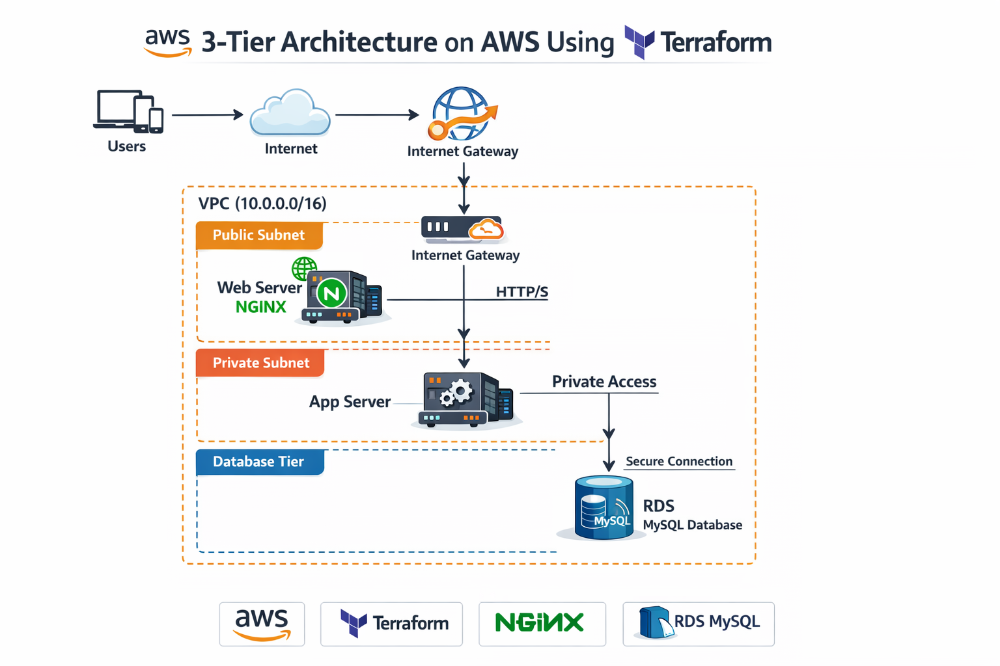
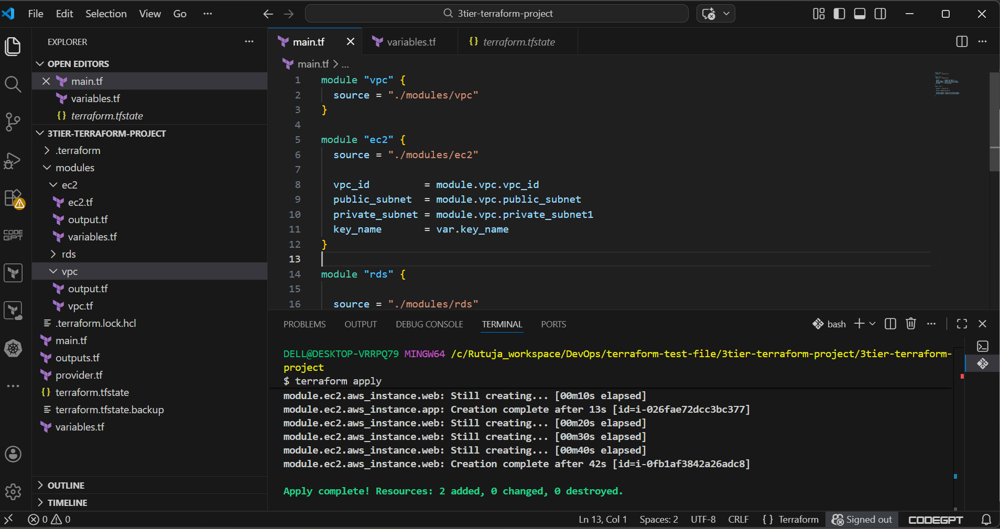
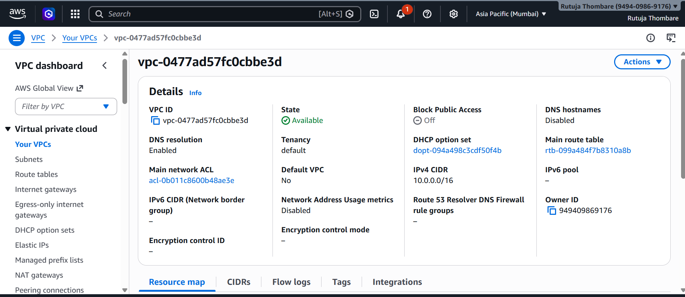
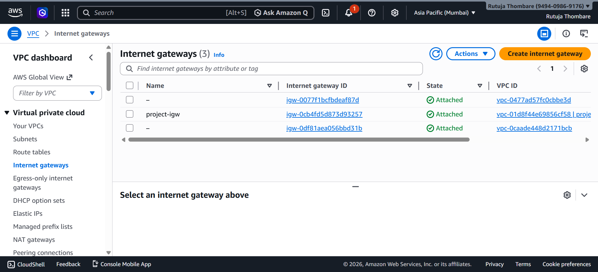
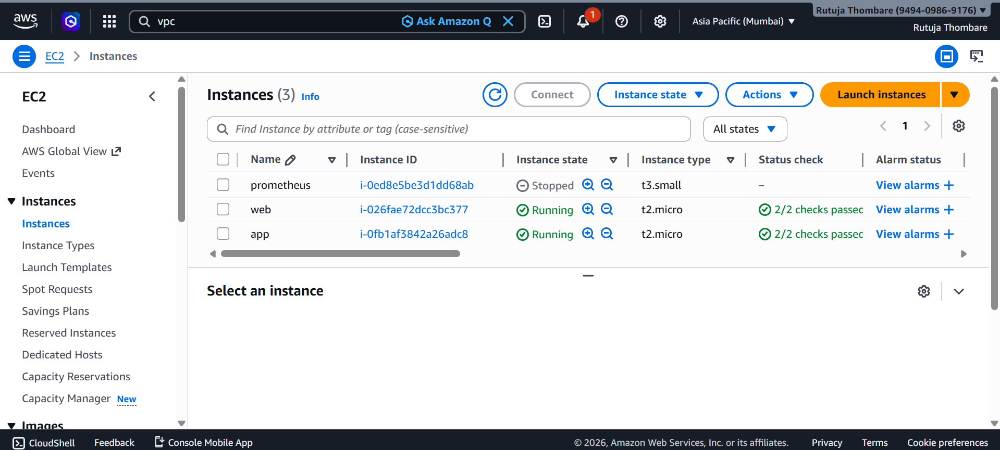
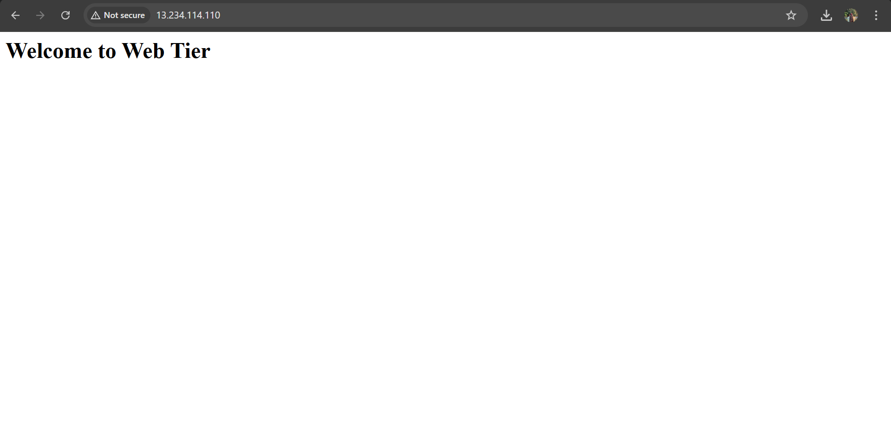
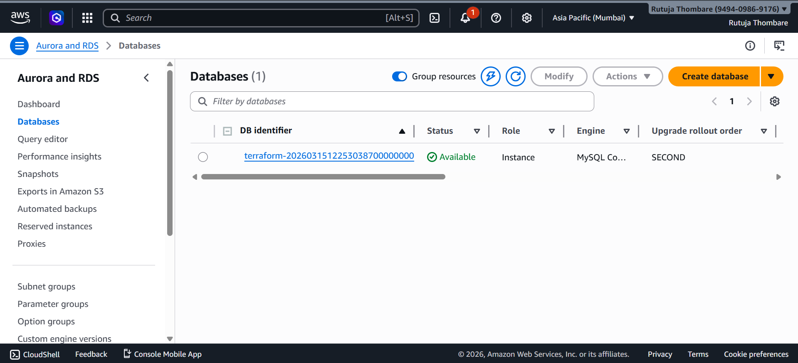
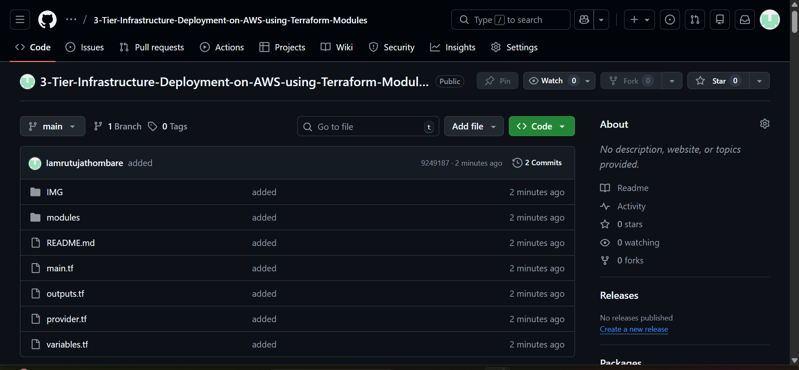

# 3-Tier Infrastructure Deployment on AWS using Terraform Modules

# Project Overview

This project demonstrates how to design and deploy a **3-Tier
Infrastructure on AWS using Terraform Modules**.

The infrastructure is created using **Terraform (Infrastructure as
Code)** which allows automated, repeatable, and consistent cloud
deployments.

The architecture divides the application into three layers:

-   **Web Tier** -- Handles client requests
-   **Application Tier** -- Processes business logic
-   **Database Tier** -- Stores application data

This design improves:

-   Security
-   Scalability
-   Maintainability
-   Performance

------------------------------------------------------------------------

# Architecture

User → Internet → Internet Gateway → Web Server → Application Server →
Database

### Infrastructure Components

The following AWS services are used:

-   VPC (CIDR: 10.0.0.0/16)
-   Public Subnet
-   Private Subnet
-   Internet Gateway
-   EC2 Instance -- Web Server (Nginx)
-   EC2 Instance -- Application Server
-   Amazon RDS MySQL Database

Architecture Design:

-   Web Server deployed in **Public Subnet**
-   Application Server deployed in **Private Subnet**
-   RDS Database deployed in **Private Subnet**

Only the Web Tier is exposed to the internet for improved security.

------------------------------------------------------------------------

# Architecture Diagram

------------------------------------------------------------------------

# Technologies Used

  Technology   Purpose
  ------------ ------------------------
  AWS          Cloud Infrastructure
  Terraform    Infrastructure as Code
  EC2          Compute Service
  VPC          Network
  RDS          Managed Database
  Nginx        Web Server
  GitHub       Code Repository

------------------------------------------------------------------------

# Project Structure

    terraform-3tier

    modules
    ├── vpc
    │   └── vpc.tf
    ├── ec2
    │   └── ec2.tf
    └── rds
        └── rds.tf

    main.tf
    provider.tf
    variables.tf
    outputs.tf
    README.md

------------------------------------------------------------------------

# Prerequisites

Before running this project ensure the following tools are installed:

-   AWS CLI
-   Terraform
-   Git
-   AWS Account

Configure AWS CLI:

    aws configure

------------------------------------------------------------------------

# Deployment Steps

## 1. Clone the Repository

    git clone https://github.com/Iamrutujathombare/3-Tier-Infrastructure-Deployment-on-AWS-using-Terraform-Modules.git

    cd Project_no_3_Tier_infrastructure_Deployment_Using_Terraform_Modules_on_AWS

------------------------------------------------------------------------

## 2. Initialize Terraform

    terraform init

------------------------------------------------------------------------

## 3. Check Terraform Plan

    terraform plan

------------------------------------------------------------------------

## 4. Deploy Infrastructure

    terraform apply

Type **yes** to confirm deployment.

Terraform will create:

-   VPC
-   Subnets
-   Internet Gateway
-   EC2 Instances
-   RDS Database

------------------------------------------------------------------------

# Access Web Server

After deployment Terraform will output the **Public IP of the Web
Server**.

Open in browser:

    http://WEB_PUBLIC_IP

Expected output:

    Welcome to Web Tier

------------------------------------------------------------------------

# Terraform Outputs

  Output          Description
  --------------- -------------------------
  web_public_ip   Public IP of Web Server
  rds_endpoint    RDS Database Endpoint

------------------------------------------------------------------------

# Screenshots

  ---------------------------------------------------------------------------------
  Screenshot                 Description                  Image
  -------------------------- ---------------------------- -------------------------
  Terraform Deployment       Infrastructure created using 
                             Terraform apply command      

  VPC Configuration          Custom VPC with CIDR block   
                             10.0.0.0/16                  

  Internet Gateway           Internet Gateway attached to 
                             VPC                          

  EC2 Instances              Web and Application EC2      
                             instances running            

  Web Server Output          Nginx web page accessed      
                             using EC2 public IP          

  RDS Database               Amazon RDS MySQL database    
                             instance created             

  GitHub Repository          Terraform project code       
                             stored in GitHub             
  ---------------------------------------------------------------------------------

------------------------------------------------------------------------

# Advantages

-   Infrastructure automation using Terraform
-   Modular Terraform structure
-   Secure network architecture
-   Scalable cloud infrastructure
-   Faster and repeatable deployments

------------------------------------------------------------------------

# Author

**Rutuja Thombare**

DevOps & Cloud Enthusiast

------------------------------------------------------------------------

# Conclusion

This project demonstrates how to deploy a **3-Tier AWS Infrastructure
using Terraform Modules**.

By separating the application into Web, Application, and Database
layers, the architecture improves security, scalability, and
maintainability while following modern DevOps practices.
